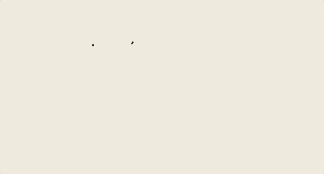
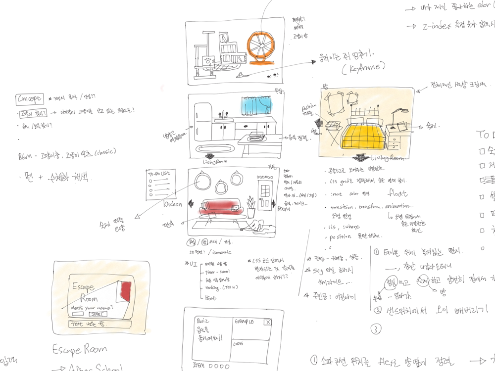
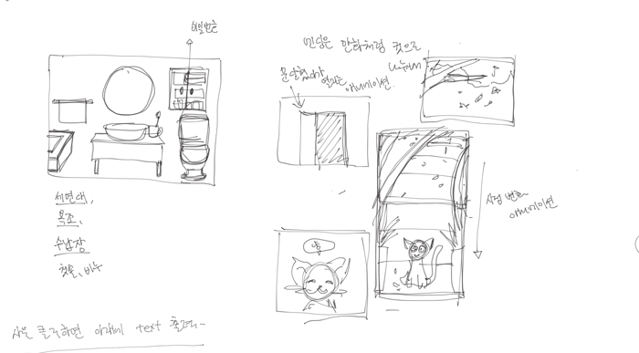
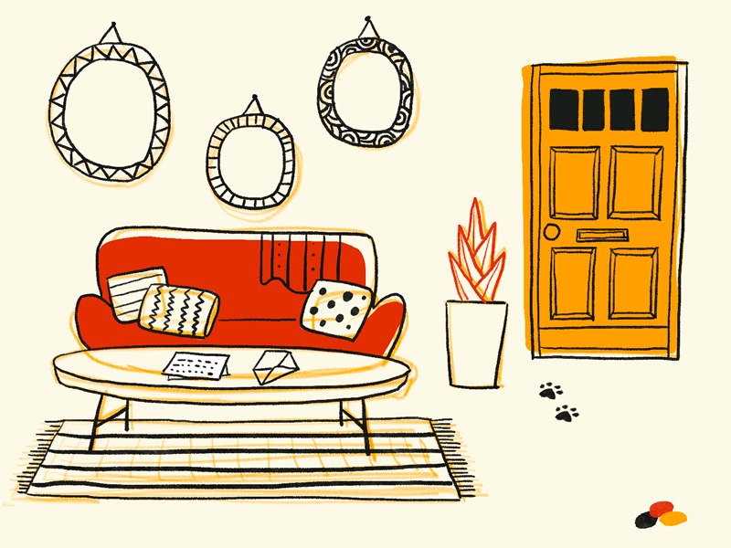
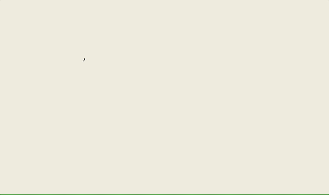
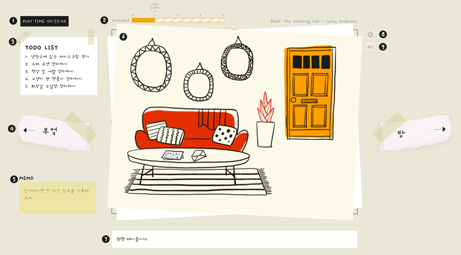
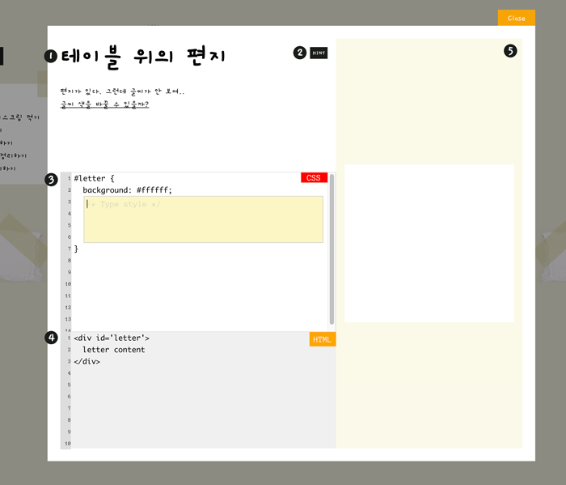
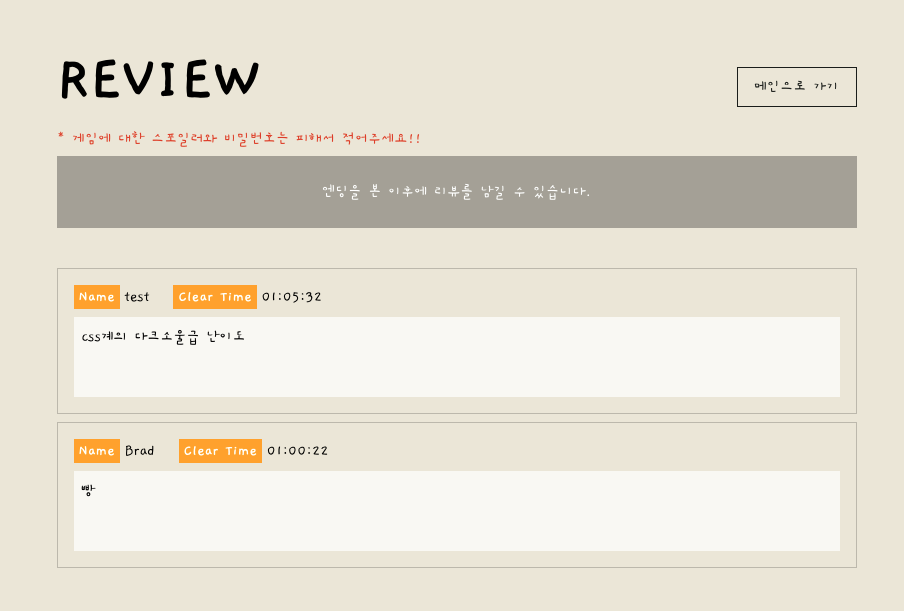
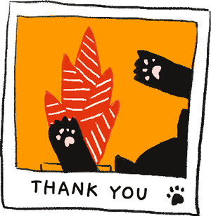

# Where Are You?

  

## 📝 Table of Contents

- [Introduction](#introduction)
- [Motivation](#motivation)
- [Reference](#reference)
- [Plan](#plan)
- [Drawings](#drawings)
- [Tech Stacks](#tech-stacks)
- [How to play](#how-to-play)
- [Reasons](#reasons)
- [Issues](#issues)
- [Comments](#comments)

## Introduction

- CSS를 사용하여 방을 탈출하는 게 최종 목표인 포인트 앤 클릭 형식의 게임입니다.
- 이미지를 클릭하면 나오는 퍼즐을 풀고 비밀번호 힌트를 획득하여 탈출할 수 있습니다.
- 개발 기간 : 2021년 5월 3일 (월) ~ 2021년 5월 21일 (금) 약 3주

## Motivation

- Flexbox를 알아보기 위해 검색하다 🐸 Flexbox Froggy 라는 게임을 하게 되었는데, 게임을 통해 CSS 사용법을 쉽게 이해할 수 있어서 인상 깊은 경험이었습니다.
- Flexbox Froggy처럼 플레이어들이 더 재밌게 CSS를 배울 수 있는 게임을 만들어보면 어떨까 싶어 관련 내용을 찾아보다 우연히 codepen에서 CSS를 사용한 간단한 방탈출 게임을 발견했습니다. 평소에도 지인들과 모임을 만들어 주기적으로 방탈출 카페를 방문할 정도로 방탈출 게임을 좋아해서, 해당 게임에서 모티브를 얻어 좀 더 본격적인 CSS 방탈출 게임을 개발하게 되었습니다.

## Reference

- [Flexbox Froggy](https://flexboxfroggy.com/#ko)
- [Codepen - Escape Room!](https://codepen.io/KristopherVanSant/pen/dEZZEN)

## Plan

- [목업 & 컨셉 디자인](https://app.moqups.com/n91TxAczUy/view/page/ad64222d5)
- [Database 구조](https://lucid.app/lucidchart/afa24569-3cdb-4d2d-b64b-c3a6e951750e/view)
- [Task Cards](https://www.notion.so/ffcbbd5ba25f4eedb91260290d56b910?v=a6798e56f99b4e4f817d63a8920614c3)

## Drawings

- 게임에 사용할 이미지를 본격적으로 그리기 전 컨셉 구상을 위한 스케치 및 기획 관련 메모입니다. 개발 단계에서 수정된 부분도 많지만 메인 컨셉은 그대로 유지하였습니다.

  
  

- 위의 단계를 거쳐 최종적으로 나온 결과물이 아래와 같습니다.

  

## Tech stacks

### Frontend

- ES2015+
- React
- React-router-dom
- Redux
- Redux-persist
- styled-component
- workbox

### Backend

- Express
- MongoDB Atlas
- NodeJS

## 지원하는 브라우저

- Chrome (권장)
- Safari
- Edge
- Firefox

## How to play

### Main

  

- 메인 페이지에서 이름을 입력하고 Game Start 버튼을 클릭하면 게임이 시작됩니다.
- 만약 이전에 게임을 진행했던 데이터가 남아있다면, Continue 버튼을 눌러 이어서 하거나 New Game을 선택하여 새로운 게임을 시작할 수 있습니다.

### Game - Room

  

- 이미지 설명
  1. 게임 플레이 타임
  2. 해제한 비밀번호 갯수
  3. 최종 비밀번호를 위해 반드시 풀어야하는 비밀번호 목록
  4. 방 이동 버튼
  5. 클릭을 할 수 있는 게임 플레이 공간
  6. 이미지를 클릭할 때 나오는 설명을 확인할 수 있는 텍스트 박스
  7. 메뉴 - 메인으로 가기 / 리뷰보러 가기
  8. BGM 재생 / 멈춤
- 메인 페이지의 여러 오브젝트를 클릭하면 이벤트가 실행됩니다.
- 이벤트 종류
  - 이미지 변경
  - 상세 이미지 모달
  - 비밀번호 입력 모달
  - CSS 문제를 푸는 모달
- CSS 문제를 푸는 모달에서 문제를 읽고 올바른 정답을 입력하면 비밀번호에 대한 힌트를 얻을 수 있습니다.

### Game - Puzzle

  

- 이미지 설명
  1. 제목 및 문제
  2. 문제와 관련된 CSS 힌트
  3. CSS 문제와 직접 CSS를 입력할 수 있는 칸
  4. CSS가 적용되는 마크업 구조
  5. 적용된 CSS를 실시간으로 볼 수 있는 결과 창
- 정답을 입력하면 비밀번호에 대한 힌트를 얻을 수 있습니다.

### Review

  

- 게임 화면의 메뉴 아이콘을 클릭하여 리뷰 보러가기 버튼을 클릭하면 다른 사람들이 남긴 리뷰를 확인할 수 있습니다.
- 리뷰는 엔딩을 본 플레이어들만 남길 수 있습니다.
- 리뷰를 남길 땐 게임의 **비밀번호와 스포일러는 피해야합니다.**

## Reasons

### CSS puzzles

- 플레이어가 CSS 문제를 풀 수 있는 방식을 기존에는 Selector와 CSS를 모두 입력할 수 있는 에디터를 기획했습니다. 그러나 해당 방식을 사용하면 다양한 문제를 출제할 수는 있지만 플레이어들의 행동을 제어하기가 어려웠습니다. 엉뚱한 Selector를 사용하여 UI가 깨지거나 아니면 모든 엘리먼트를 아예 삭제하여 문제의 출제 의도와 어긋나는 방향으로 비밀번호를 풀 확률이 높았기 때문에 기존 기획에서 현재의 방식을 선택하게 되었습니다.

### Redux-persist

- 브라우저를 종료 하더라도 게임을 이어서 할 수 있는 세이브 기능을 넣고 싶었습니다. 세이브 데이터의 저장 위치에 대해서 고민을 했는데 DB에 저장하는 것과 `Local Storage`에 저장하는 두 가지 방법을 모색했습니다. 로그인 필요 없이 익명으로 이름을 작성하여 플레이하는 게임인 만큼 플레이어의 데이터를 따로 저장하지 않아서 `Local Storage`에 세이브 데이터를 저장하는 방식을 선택했고, 게임 데이터를 Redux로 관리하기 때문에 이를 구현하기 위해서 `redux-persist`를 사용하였습니다.

## Issues

### Real Time CSS

- 실시간으로 플레이어가 입력한 CSS를 적용하기 위해 처음에는 `styled-component`를 사용하려고 했습니다. 스타일을 적용해야하는 HTML에 `selected`라는 클래스명을 줘서 해당 엘리먼트에 플레이어가 입력한 CSS를 `styled-component`를 이용해 적용했지만 기존에 적용되어있는 스타일과 충돌이 나서 제대로 적용되지 않는 문제가 발생하였습니다. 그래서 `useRef`로 `selected`를 찾아서 해당 엘리먼트에 실시간으로 인라인 스타일을 적용하여 기존에 적용된 스타일보다 먼저 적용되게끔 작업하였습니다.

### Closure

- Closure로 인해 `useSelector`로 가져온 `redux state`가 갱신되지 않는 현상이 발생했습니다.
- 이미지 이벤트를 실행하는 함수를 캔버스 관련 util 함수에 callback으로 넘겨줬는데, 해당 callback 안에 있는 모달의 오픈 여부를 결정하는 조건인 `redux state`가 업데이트된 게 반영되지 않아서 비밀번호 관련 모달이 정상적으로 실행되지 않았습니다.
- `useCanvas`라는 커스텀 훅 디펜던시에 해당 `redux state`를 넣었을 때 정상적으로 업데이트 됐지만 이번에는 캔버스가 여러번 렌더링 되는 이슈가 발생했습니다. 캔버스가 여러번 쌓이면서 이미지를 클릭했을 때 모달 실행 이벤트도 함께 쌓이는 현상이 생겼습니다.
- 모달 내부에서 `state`를 접근하면 렌더링에 바로 반영되고, 캔버스가 다시 렌더링 될 필요가 없기 때문에 비밀번호 모달 내에서 해당 `state`를 가져와 비밀번호 일치 여부를 판별하여 비밀번호 또는 퍼즐 중 어떤 것을 보여줄 지 결정하는 것으로 이슈를 해결하였습니다.
- Closure는 기초적인 개념이고 공부를 했을 때는 이해했다고 생각했지만 막상 이슈를 겪으니 처음에는 이슈의 원인 파악이 어려웠습니다. 기본부터 꼼꼼히 다져야 한다는 것을 깨닫게 된 경험이었습니다. 🥲

### Load Image on Canvas

- 이미지가 로드된 후 캔버스에 이미지를 그려주는데 이미지 로드가 비동기 작업이기 때문에 이미지가 겹쳐있는 경우 원하는 순서대로 겹쳐지지 않는 이슈가 있었습니다. (ex: 테이블 위에 우유가 올라와야 하는데 우유 이미지가 먼저 로딩되는 경우 우유 위로 테이블이 그려짐)
- 처음에는 이미지 로드와 canvas에 그리는 작업을 하나의 함수에서 실행했는데, 이를 해결하기 위해 각각 따로 분리하여 이미지 로드 함수를 promisify 하여 `new Image()` 로 선언한 이미지를 리턴해주면, `async/await`을 사용하여 해당 `Proimise`로 이미지를 받아 그것을 캔버스에 그려주는 방식으로 수정하였습니다.

### OOP

- 이미지를 캔버스에 그리기 위해 기존에는 캔버스 관련 uitl에 이미지 관련 메소드를 모두 넣고 `useCanvas` 커스텀 훅에서 부르는 방식을 사용했습니다. 하지만 이벤트가 여러 번 쌓이고, 새로 이벤트를 추가하는 작업이 쉽지가 않았습니다. 그래서 객체 지향 방식으로 각 이미지들을 class를 사용하여 리팩토링 하였습니다. 캔버스에 그려지는 아이템들을 공통 `class`로 묶고 기존에 방마다 배열에 담긴 객체로 관리하던 이미지 정보들을 불러와 각각 인스턴스화 시켰습니다. 그리고 이미지 로드부터 캔버스에 그리는 작업, 이미지 전환 등 util에서 관리하던 함수들을 메소드로 추가하였습니다.
- 단순히 util 함수로 사용하던 것을 class로 추상화 시켜 공통 속성을 가진 인스턴스의 메소드로 사용을 하니 이벤트에 특정 이벤트를 추가하거나 삭제하는 것이 훨씬 용이해졌습니다.
- 이론적으로 공부는 했지만 프로젝트에 실제로 OOP라는 개념을 인지하고 사용한 것은 처음이었습니다. 특정 기능을 구현하는 것도 중요한 일이지만 그 전에 어떤 방식으로 로직을 작성할 것인지 결정하고 설계하는 것이 얼마나 중요한 일인지 깨달았습니다.

### Service worker

- 게임을 오프라인 상황에서도 사용할 수 있게 하려면 어떤 방법이 있을지 찾아보다 `service worker`를 알게 되어 해당 기능을 적용했습니다.
- `service worker`를 쉽게 관리할 수 있게 해주는 `workbox` 라이브러리를 사용하여 이미지, 음악 등 게임에 필요한 파일들을 pre-cache하였습니다. 그리고 문제와 비밀번호를 가져오는 API도 cache에 저장하였습니다. 만약 파일에 변경이 생겨 cache에 저장된 파일과 다른 경우 새로 업데이트를 받게 하기 위해 `workbox`의 `StaleWhileRevalidate`라는 Strategy를 사용하였습니다.
- 처음 기획부터 모바일 / 앱을 염두에 두었던 것이 아니라 이번 프로젝트에는 오프라인 지원 기능만 추가하게 되었지만, `service worker`를 사용하면서 `PWA`에 대한 개념과 관련 내용에 대해서도 함께 알 수 있어서 뜻깊은 경험이었습니다.

### Cross browsing

- 퍼블리셔로 일할 때에는 회사의 특성 상 IE까지 맞춰야 하는 어려움이 있었는데, 이번 프로젝트는 최신 브라우저를 기준으로 작업하여 크로스 브라우징에 무리가 없을 거라 생각했습니다.
- 하지만 브라우저마다 다르게 적용되는 CSS 속성들이 있었습니다. Safari에서는 `float`를 사용한 요소 옆으로 긴 텍스트는 붙지 않아서, 해당 이슈를 해결하기 위해 문제의 답이었던 `float`를 `flex`로 변경할 수밖에 없었습니다. 그리고 position 속성을 사용하였을 때 top 위치가 Safari에서만 다르게 보여 Safari에서만 적용되는 CSS hack을 사용하였습니다.
- 이번 이슈를 해결하면서 Reset CSS를 사용하더라도 모든 브라우저가 완벽하게 동일한 형태로 적용되지 않는다는 것을 알게 되었고, 플레이어의 동일한 UI/UX 경험을 위해서는 사소한 부분까지 꼼꼼히 신경을 써야한다는 걸 다시금 명심하게 되었습니다.

###  Web Accessibility

- 이전에 웹 접근성 심사를 받기 위한 프로젝트를 진행한 경험이 있는데, 캔버스를 사용한 이번 프로젝트 같은 경우에는 웹 접근성을 어떤 방식으로 작업해야하는 지 궁금해져서 적용하게 되었습니다.
- 캔버스 같은 경우는 웹 접근성을 위해서는 부적절한 요소이기 때문에 지양해야 된다는 걸 알게 되었고, 사용해야 하는 경우 캔버스에 그려진 요소들을 상세하게 설명해줘야 했습니다. 그래서 캔버스에도 현재 화면에 대한 설명을 추가하고 스크린 리더로 테스트를 하면서 tab으로 위치를 이동하면서 키보드로 조작할 수 있는 기능을 추가하였습니다.
- 이전에도 느낀 점이지만 웹 접근성을 지키기 위해서는 처음 기획 단계부터 준비를 하는 게 중요했습니다. 완벽한 웹 접근성을 지키는 웹/앱을 만드는 것은 어려운 일이지만 포인트 앤 클릭 방식 + 게임이라는 특성 상 이번 프로젝트에서는 제대로 적용할 수 없어서 아쉬움이 남습니다.

## Comments

- 퍼블리셔로 일을 하면서 개발을 공부해야겠다고 마음먹게 된 계기 중 하나가 화면에 제가 원하는 것을 자유롭게 표현하고 싶다는 것이었습니다. 개인 프로젝트를 하게 되면 디자인과 이미지 작업까지 직접 하고 싶었는데 좋아하는 주제를 모아서 기획, 디자인, 이미지 작업, 그리고 개발까지 하니 즐겁게 할 수 있었습니다.
- 내가 과연 이 기능을 구현할 수 있을까? 고민하면서 새로운 기술을 쓰는 데에 어려움을 느낄 때가 많았지만 개인 프로젝트를 진행하면서 일단 부딪혀보고 새로운 것에 도전하자는 생각을 키울 수 있었습니다. 프로젝트를 통해 느꼈던 성취감과 소중한 경험들은 이후 실무에서도 소중한 경험이 될 것 같습니다.
- 처음 부트캠프를 시작할 때만 해도 프로젝트를 발표하는 날이 멀게 느껴졌지만 막상 시작하니 반 년에 가까운 시간이 찰나의 순간처럼 지나갔습니다. 아직도 취업에 대한 두려움과 내가 과연 잘 할 수 있을까, 라는 두려움이 있지만 바닐라코딩에서 보냈던 시간들을 바탕으로 잘 이겨낼 수 있을 것 같습니다. 💪

  

